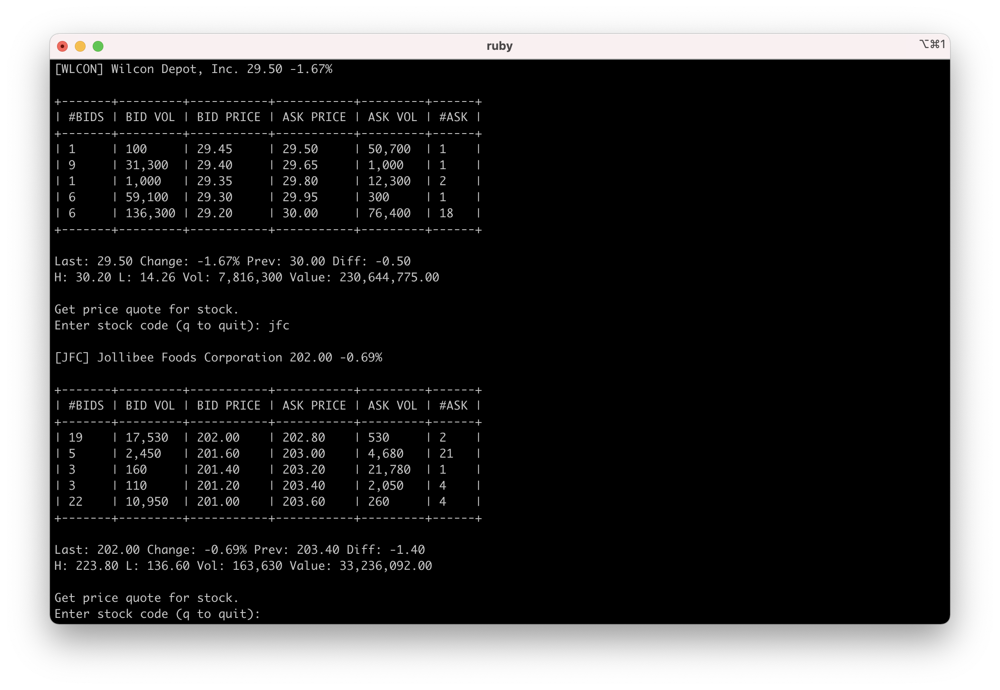

# BPI Trade Console

This program aims to solve the problem of logging in to your BPI Trade account and check your portfolio. **Pain point:** BPI Trade's platform is ugly and slow. Wouldn't it be better if we can check our portfolio on the command line? 

## Usage

First, you will need to create a `config.rb` file. 

	# Config file for password
	# Include in .gitignore
	module Config
		def get_username
			"YOUR USERNAME"
		end

		def get_password
			"YOUR PASSWORD"
		end

		def quotes_api_call(stock)
			"YOUR API ENDPOINT TO GET STOCK QUOTES"
		end
	end

Save the `config.rb` file then run on console.

`$ ruby bpi2console.rb` 

## Issues

It may not work if you have a different api endpoint.

## Future Features

- Would like to add quotes *(DONE)*
- buying and selling through the console.
